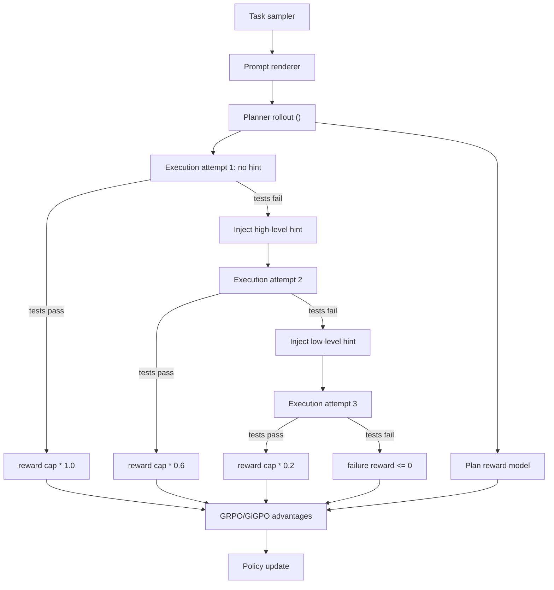

# Provenance-Discounted Hierarchical RL For Agentic SWE

This approach is a second-stage agentic software-engineering curriculum. It is
not a replacement for SFT, preference tuning, or RLVR. It should be applied
after the model can already follow instructions, call tools, and produce valid
code patches.

## Objective

Train an LPLM checkpoint to solve long-horizon software engineering tasks in a
stateful repository environment while avoiding three common failures:

- Sparse rewards from pass/fail test results.
- Exploration collapse when early rollouts fail every task.
- Model collapse from over-reliance on synthetic coding tasks.

The method introduces:

- A separate planning reward for `<PLAN>` quality.
- A fallback hint curriculum for execution.
- Reward caps based on task provenance.
- Blind prompt formatting so the model cannot infer provenance.

## Training Architecture

## Stage Breakdown

### 1. Task And Provenance Mixture

Use two task sources:

| Source | Description | Max Reward |
| --- | --- | --- |
| `human_verified` | Real issues solved by humans, with merged PR diffs and tests. | `1.0` |
| `synthetic` | LLM-generated issues, solutions, tests, or repository edits. | `0.6` |

Recommended sampling:

- 20 percent human-verified anchor tasks.
- 80 percent synthetic volume tasks.

The prompt shown to the model must be identical across provenance classes.
Provenance is only visible to the reward engine.

### 2. Offline Hint Distillation

For each human-verified task, generate static hints from the merged human diff:

- `conceptual`: high-level nudge without file or line answer.
- `localized`: points to relevant subsystem, file, or failing behavior.
- `procedural`: explicit step sequence, still without blindly pasting a patch.

For synthetic tasks, hints can be generated from the synthetic solution, but
the reward cap must remain lower.

### 3. Planning Objective

Before editing, require a `<PLAN>` block. Score it separately from execution:

- Does it reproduce or inspect the failure?
- Does it identify plausible files or modules?
- Does it propose a minimal edit strategy?
- Does it include a verification step?
- Does it avoid broad rewrites?

This gives the model a dense signal even when execution fails.

### 4. Execution Objective

Run the agent in the repository sandbox:

1. No-hint attempt.
2. High-level hint fallback if tests fail or the agent stalls.
3. Low-level hint fallback if tests still fail.
4. Terminal failure if low-level hint does not produce a valid solution.

The agent should not see the numeric discount. It only sees environment
feedback and hints.

### 5. Policy Optimization

Use GRPO by default:

- Sample `G` rollouts per task.
- Compute shaped returns for each rollout.
- Normalize advantages inside the group.
- Apply KL control against the previous post-trained checkpoint.

Use GiGPO when mixing human and synthetic task groups in the same update and
you want nested normalization by provenance bucket.

## Required Environment Components

The trainer needs a stateful SWE environment:

- Repository checkout manager.
- Patch application and rollback.
- Shell/test runner.
- Timeout and resource controller.
- Tool transcript recorder.
- Hint lookup database.
- Reward calculator.
- Rollout store.

The current `post_training/train_reasoning_rlvr.py` handles single-turn
verifiable rewards. This additional approach needs an agentic environment
wrapper around multi-step tool use.

## Promotion Criteria

Promote only if:

- Pass@1 improves on human-verified held-out tasks.
- Hint reliance decreases over training.
- Synthetic task performance does not dominate human task performance.
- Patch size remains bounded.
- Test pass improvements are not caused by deleting tests or weakening checks.
- Tool transcripts show valid, reproducible edits.
